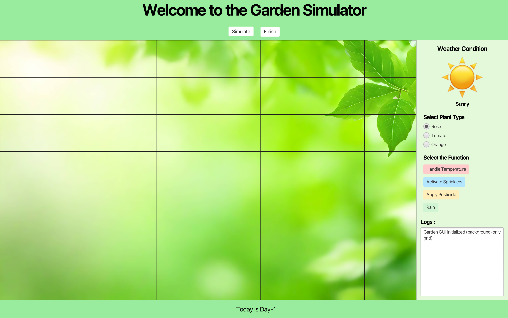
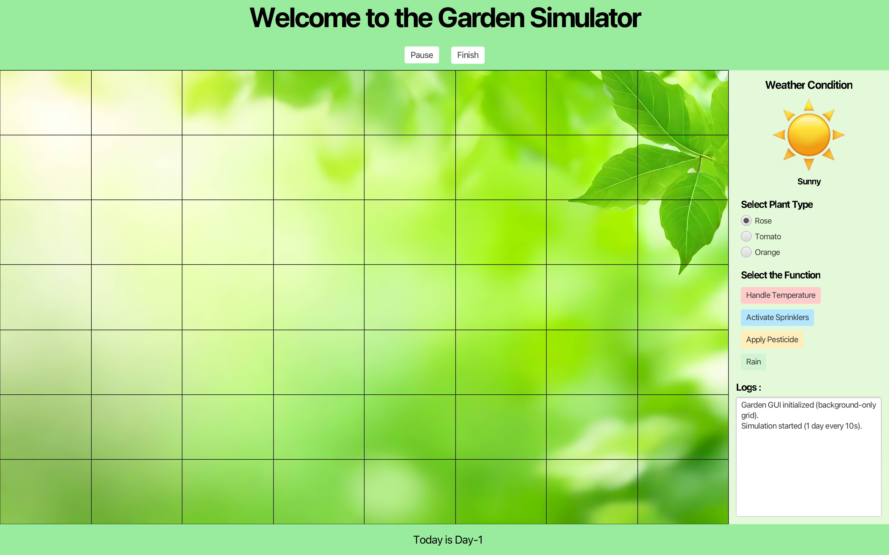
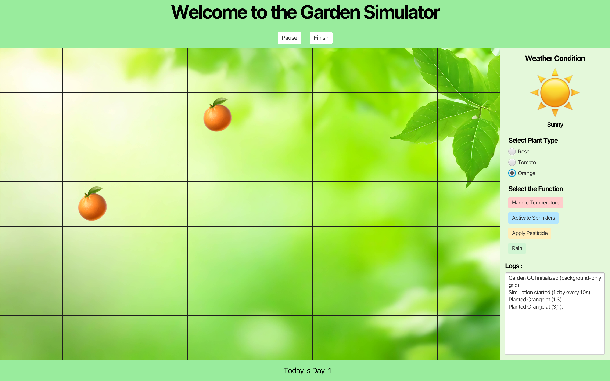
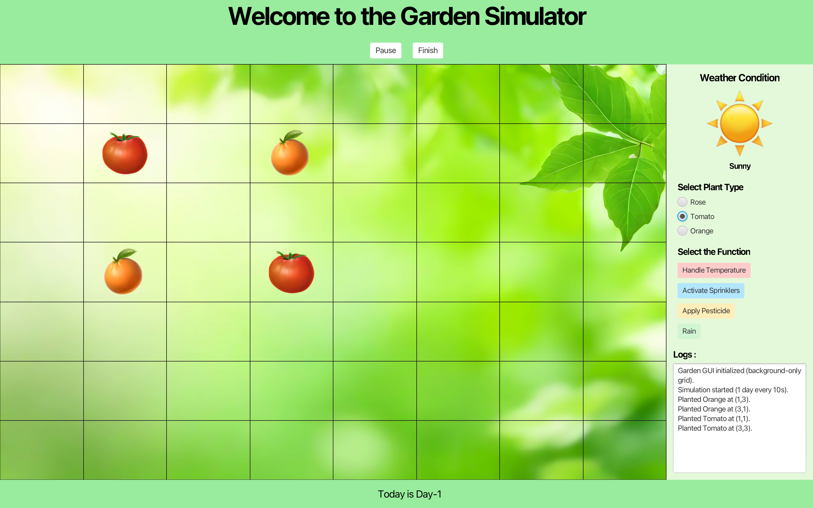
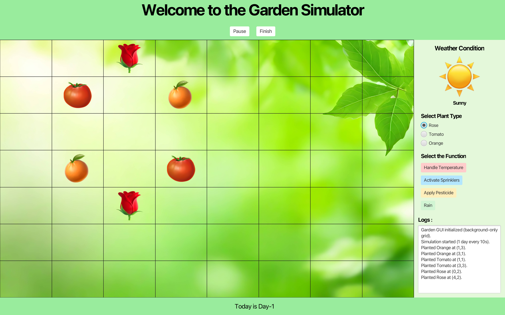
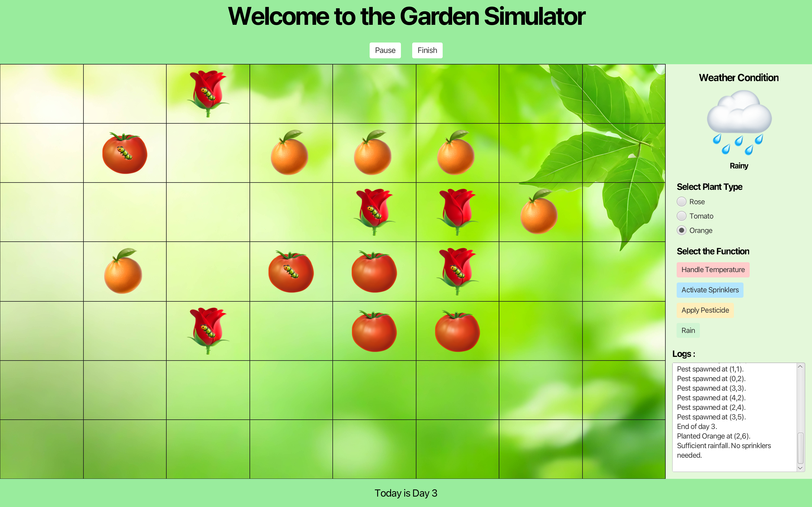

# Computerized Garden (GardenSim)

**Computerized Garden** - a.k.a. **GardenSim** - is a Java 17 + JavaFX 22 project that simulates a small garden.  

You can **plant** (Rose, Tomato, Orange), **simulate weather**, **spawn/control pests**, and watch plants **survive or die** over days.  

It supports two modes:
- **GUI mode** (JavaFX): interactive, visual garden
- **API mode** (headless): programmatic simulation for graders/automation


## Features

### Garden (GUI)
- **Background grid** (7×8) with fixed, equal cells
- **Click-to-plant** with radio buttons (Rose, Tomato, Orange)
- **Pests** randomly spawn; pesticide removes them; pests can kill plants
- **Weather controls**: Rain, Sprinklers, Temperature (heating)
- **Auto day progression** via **Simulate** (toggle Start/Pause)
- **Logs** panel + file logging to `garden-simulation.log`

### API (Headless)
- Programmatic control via `GardenSimulator` & `GardenSimulatorAPI`
- Reads **`config.json`** for plant definitions
- Simulates **rain**, **temperature**, and **parasites**
- Adjustable speed and parameters via JVM flags (e.g. `-Ddays`, `-Dpest`, `-DtickMs`)


## Project Structure

```
GardenSim/
├── run                             # macOS/Linux runner (GUI by default; "api" for headless)
├── run.bat                         # Windows runner (GUI by default; "api" for headless)
├── pom.xml                         # Maven build file
├── README.md                       # Project documentation
├── garden-simulation.log           # Runtime log (gitignored/local)
├── src/
│   ├── main/
│   │   ├── java/com/gardensim/
│   │   │   ├── GUIMain.java                # JavaFX app entry (GUI)
│   │   │   ├── ViewController.java         # UI logic
│   │   │   ├── GardenSimulator.java        # Headless simulation entry
│   │   │   ├── GardenSimulatorAPI.java     # API surface; loads config.json
│   │   │   ├── GardenController.java       # Simulation control
│   │   │   ├── GardenThread.java           # Simulation thread/timing
│   │   │   ├── Plant.java
│   │   │   ├── Rose.java
│   │   │   ├── Tomato.java
│   │   │   ├── Orange.java
│   │   │   ├── Pest.java
│   │   │   ├── PestAttackController.java   # Pest behavior
│   │   │   ├── RainController.java
│   │   │   ├── SprinklerController.java
│   │   │   ├── PesticideController.java
│   │   │   ├── TemperatureController.java
│   │   │   └── HeatingController.java
│   │   └── resources/
│   │       ├── com/gardensim/view.fxml     # JavaFX layout
│   │       ├── config.json                 # Simulation config
│   │       ├── log4j2.properties           # Logging config
│   │       └── images/                     # GUI assets
│   │           ├── garden.jpg
│   │           ├── sunny.png
│   │           ├── rain.png
│   │           ├── rose.png
│   │           ├── tomato.png
│   │           ├── orange.png
│   │           └── bug.png
│   └── test/java/                          # (empty placeholder for unit tests)
├── docs/                                   # Project report and slides.
│   ├── Report.pdf
│   ├── Slides.pdf
│   └── Slides.pptx
└── imagesReadMe/                           # For screenshots in README.md
    ├── image1.png
    ├── image2.png
    ├── image3.png
    ├── image4.png
    ├── image5.png
    ├── image6.png    
    └── image7.png
```


## Prerequisites

- **Java**: JDK **17** (or newer, compatible with JavaFX 22)
- **Maven**: **3.9+**
- **Git**: for cloning (optional but recommended)
- **IDE** (optional): Any modern Java IDE.  
  - Initially developed in **IntelliJ IDEA Community Edition**  
  - Also tested with **Visual Studio Code**

### Verify:
```bash
java -version
mvn -v
```


## First Run (Setup)

### 1. Clone
```bash
git clone https://github.com/gardensim/GardenSim.git
cd GardenSim
```

### 2. Make the runner executable *(macOS/Linux)*
```bash
chmod +x run
```

### 3. *(Windows)* just use `run.bat`.


## How to Run... ?

### GUI (default)
- **macOS / Linux**
  ```bash
  ./run
  ```
- **Windows**
  ```bat
  run
  ```

> This launches the JavaFX app (`GUIMain`).



### API (headless)
- **macOS / Linux**
  ```bash
  ./run api
  ```
- **Windows**
  ```bat
  run api
  ```

### Optional JVM flags (tune the headless simulation):
- `-Ddays=<int>`: how many days to simulate (default: script/main decides)
- `-Dpest=<0..1>`: pest spawn probability per occupied cell per day (e.g. `0.3`)
- `-DtickMs=<int>`: ms per simulated “day tick” (e.g. `1000` ms)

#### Examples
**macOS / Linux**
```bash
./run api -Dexec.jvmArgs="-Ddays=15 -Dpest=0.35 -DtickMs=1200"
```

**Windows**
```bat
run api -Dexec.jvmArgs="-Ddays=20 -Dpest=0.25 -DtickMs=800"
```

> Under the hood, `run api` uses a Maven profile to launch `GardenSimulator`.


## Using the GUI

1. Click **Simulate** to start/pause the day cycle (e.g., 1 day every 10s).

    

2. Choose a plant (**Rose** *(default)* **/ Tomato / Orange**).

    

3. Click a grid cell to plant.

    

    

    

4. Use **Rain**, **Sprinklers**, **Apply Pesticide**, and **Handle Temperature**.

    

5. Watch the **Logs** panel (and `garden-simulation.log`) for events.


## Build / Package

Build (compile & package):
```
mvn -q -DskipTests package
```

Run GUI via Maven (without scripts):
```
mvn -q -DskipTests javafx:run
```

Run API via Maven (without scripts):
```
mvn -q -Papi exec:java
```

> A fat/uber JAR is **not** provided by default because JavaFX apps typically run with the Maven JavaFX plugin. Use the **run scripts** or the **Maven commands** above.


## Build & Run with Maven Wrapper

If you don’t have Maven installed globally, you can use the provided **Maven Wrapper** scripts (`mvnw`, `mvnw.cmd`, `.mvn/wrapper/`).

This ensures the correct Maven version is downloaded automatically.
- **macOS/Linux**
  ```bash
  ./mvnw clean javafx:run
  ```

- **Windows**
  ```bat
  mvnw.cmd clean javafx:run
  ```

- **You can also package the project:**
  ```
  ./mvnw -q -DskipTests package
  ```


## `config.json` (for API mode)

The API loads plant definitions from `src/main/resources/config.json`.  
Here’s a **recommended** minimal example (aligns with the GUI options):

```json
{
  "plants": [
    { "name": "Rose",    "waterRequirement": 20, "temperature": 22, "parasites": ["Aphids", "Spider mites"] },
    { "name": "Tomato",  "waterRequirement": 18, "temperature": 23, "parasites": ["Whiteflies", "Leafhoppers"] },
    { "name": "Orange",  "waterRequirement": 24, "temperature": 25, "parasites": ["Scale", "Leaf miners"] }
  ]
}
```

> You can extend this list; the API will load any additional plants you define here. The GUI currently provides radio buttons for the three above.


## Logging

- All significant events are logged to:
    - **UI panel** (right side)
    - **File**: `garden-simulation.log` (project root)

> If the file grows large, you can delete it safely; a new one will be created next run.


## Troubleshooting

- **Insets is not a valid type (FXML load error)**  
  Ensure there’s no `<Insets .../>` node without proper import. Our `view.fxml` avoids this. If you edited FXML, remove stray `Insets` elements or specify them via styles.

- **`ClassCastException: Group -> StackPane` when clicking cell**  
  This happens if the grid contains a non-`StackPane` child. Use the provided `view.fxml` and controller code. If you migrated from an older layout, **clean** and rebuild:
  ```
  mvn -q -DskipTests clean javafx:run
  ```

- **Images not visible**  
  File names in `src/main/resources/images/` must match exactly:
  `garden.jpg, sunny.png, rain.png, bug.png, rose.png, tomato.png, orange.png`.

- **JavaFX native access warnings**  
  You may see warnings about `--enable-native-access=javafx.graphics`. They’re harmless for this project.

- **GUI looks uneven**  
  Make the window larger. The grid uses equal-percentage rows/columns and scales cleanly.


## Why these `run` scripts?

Typing long Maven commands gets old.  

We provide:
- `run` (macOS/Linux) and `run.bat` (Windows)
    - **`run`** &rarr; JavaFX GUI
    - **`run api`** &rarr; headless API via Maven exec profile

This keeps the project **platform-independent** and **one-command** to start.


## License

This project is open-source under the MIT License. 

See **[LICENSE](LICENSE)**. Feel free to adapt and extend!


## Authors / Credits

- **Team of three**
    - [Divyanth Chalicham](https://github.com/Divyanth05)
    - [Varshit Purna Amrutham](https://github.com/VarshitPurna)
    - [Wineel Wilson Dasari](https://github.com/WINEEL)

---

### Project Background

Originally developed between **Sept 2024 – Dec 2024** as the final project for the course **OOADP (Object-Oriented Analysis, Design, and Programming)** at SCU.  

The Garden Simulator project (a **Computerized Garden**) was built in Java and JavaFX, applying core OOADP concepts. 
 
It featured management of **weather effects, plants, pests, seasons, logs (date/time), and sprinkler sensors**.  

The project was graded on the **survival of the garden**, with the grader running the simulation via the API to test its sustainability.

See `docs/` for the original course report and presentation used in submission.

> Our team achieved **full marks** (best survival).  

In **2025**, the project was **cleaned up, polished, and debugged** before being published on GitHub as a showcase of both a JavaFX GUI application and a headless API-based simulator.
